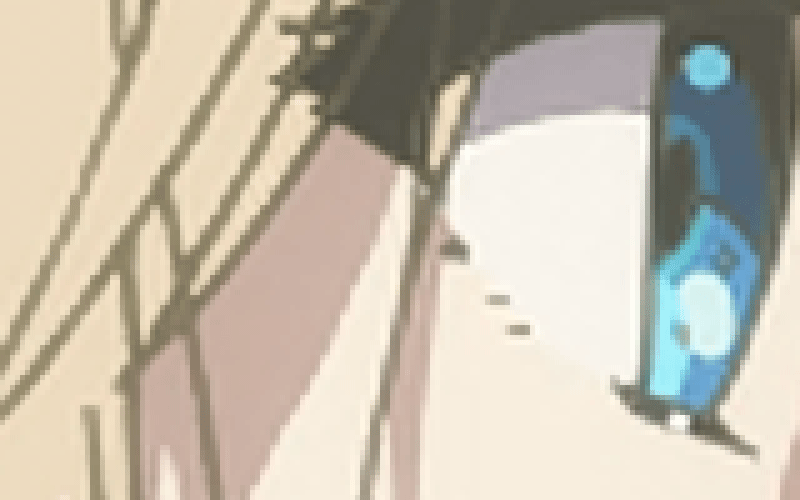

# Python Anti-Ringing
Simple anti-ringing algorithm implemented in Python. It only works with resampling filters that do not have secondary positive lobes.

To run it rename your input image into lr_input.png and place it at the same directory. Then resample to 2x scale using any filter that only rings once:
`magick convert lr_input.png -filter catrom -distort resize 200% hr_input.png`

After that, you should be able to run the script:
`python anti-ringing.py`

Example:

